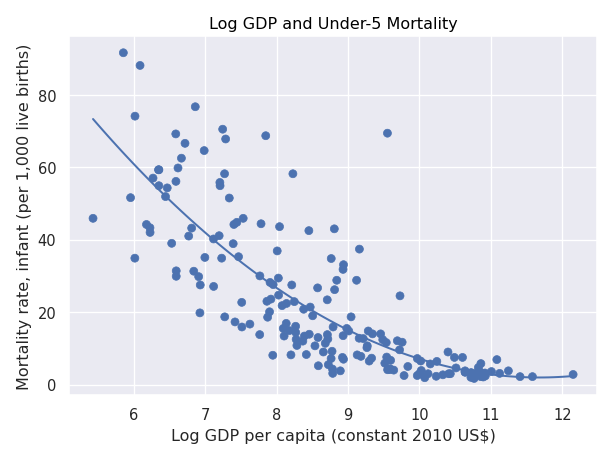

[](https://github.com/nogibjj/Diego_Rodriguez_Miniproject1/actions/workflows/hello.yml)

# IDS706-Week2
## File Structure 
```
Diego_Rodriguez_Miniproject2/
├── .devcontainer/
│   ├── devcontainer.json
│   └── Dockerfile
├── .github/
│   └── workflows/cicd.yml
├── Images/
│   └── plot.png
├── .gitignore
├── Data_summary.md
├── Main.py
├── Makefile
├── README.md
├── requirements.txt
├── test.csv
└── test_main.py
```

## Purpose of project
The purpose of this project is to present some transformation of data using Pandas and automating the publishing process. 


## Visualizations
Here is a scatter plot:



## Some summary statistics:
### Describe GDP per capita (constant 2010 US$):
| Statistics | Value |
| _______ | _______ |
| count | 198.00 |
| mean | 15335.72 |
| std | 22881.31 |
| min | 228.43 |
| 25% | 1844.39 |
| 50% | 6134.94 |
| 75% | 17655.00 |
| max | 189464.58 |


